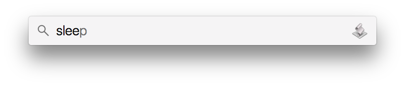

# OSX–Actions
Introducing, a set of OSX–Actions that can be called from within Spotlight.



Currently supported actions:
* Sleep
* Restart
* Shutdown
* Log out
* Start Screensaver

## Installation

First, clone this repo. 

```bash
$ cd ~/Documents
$ git clone https://github.com/chrisiona/OSX-Actions.git
```

Next let's run the installation script, which compiles the code.

```bash
$ cd OSX-Actions
$ bash install.sh 

  —— INSTALLATION SCRIPT FOR OSX ACTIONS ——

  [*] Creating directory: '/Applications/OSX Actions'
  [*] Compiling actions/Sleep.applescript
  [*] Compiling actions/Restart.applescript
  [*] Compiling actions/Shutdown.applescript
  [*] Compiling actions/Logout.applescript
  [*] Compiling actions/Start Screensaver.applescript

  You can now access these OSX Actions using Finder or Spotlight.

  https://github.com/chrisiona/OSX-Actions
```

