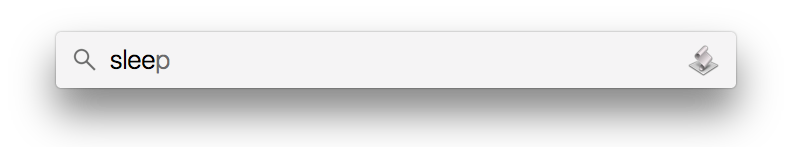

# OSX–Actions
Introducing, a set of OSX–Actions that can be called from within Spotlight.



Currently supported actions:
* Sleep
* Restart
* Shutdown
* Log out
* Start Screensaver

## Installation

First, clone this repo. 

```bash
$ cd ~/Documents
$ git clone https://github.com/chrisiona/OSX-Actions.git
```

Next let's run the installation script, which compiles the code.

```bash
$ cd OSX-Actions
$ bash install.sh 

  —— INSTALLATION SCRIPT FOR OSX ACTIONS ——

  [*] Creating directory: '/Applications/OSX Actions'
  [*] Compiling actions/Sleep.applescript
  [*] Compiling actions/Restart.applescript
  [*] Compiling actions/Shutdown.applescript
  [*] Compiling actions/Logout.applescript
  [*] Compiling actions/Start Screensaver.applescript

  You can now access these OSX Actions using Finder or Spotlight.

  https://github.com/chrisiona/OSX-Actions
```

## CONTRIBUTING

Did you find a bug?  Awesome job!  Can I ask that you please [create a ticket](https://github.com/chrisiona/OSX-Actions/issues).
Otherwise, I'd love to see a Pull Request with a patch :)   


## LICENSE

MIT License

Copyright (c) 2016 Chris Iona

Permission is hereby granted, free of charge, to any person obtaining a copy
of this software and associated documentation files (the "Software"), to deal
in the Software without restriction, including without limitation the rights
to use, copy, modify, merge, publish, distribute, sublicense, and/or sell
copies of the Software, and to permit persons to whom the Software is
furnished to do so, subject to the following conditions:

The above copyright notice and this permission notice shall be included in all
copies or substantial portions of the Software.

THE SOFTWARE IS PROVIDED "AS IS", WITHOUT WARRANTY OF ANY KIND, EXPRESS OR
IMPLIED, INCLUDING BUT NOT LIMITED TO THE WARRANTIES OF MERCHANTABILITY,
FITNESS FOR A PARTICULAR PURPOSE AND NONINFRINGEMENT. IN NO EVENT SHALL THE
AUTHORS OR COPYRIGHT HOLDERS BE LIABLE FOR ANY CLAIM, DAMAGES OR OTHER
LIABILITY, WHETHER IN AN ACTION OF CONTRACT, TORT OR OTHERWISE, ARISING FROM,
OUT OF OR IN CONNECTION WITH THE SOFTWARE OR THE USE OR OTHER DEALINGS IN THE
SOFTWARE.